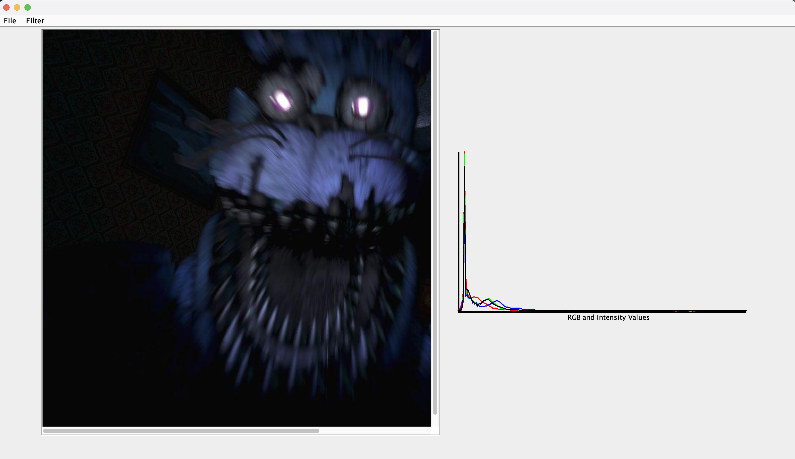

# Image Processor

*This project is for Object-Oriented Design (CS3500) at Northeastern University.*
***
Anahi Burga and Candice Mac -- 11/23/21

## Running the Processor

The image processor can be run using the main program (ImageProcessor.java) or through the 
command line. The processor can run with a pre-written script, and it can also take live text or 
interactive input. 

### Running with a Script
```
java -jar Program.jar -file [path-of-script-file]
```
Running the above command in the directory of this project will execute the commands in the script. 
The script should be a .txt file with one text command per line. A log of command execution
confirmations and error messages will be printed to the console. More information on command 
specifications can be found in USEME.md. 

### Running with Live Text Input
```
java -jar Program.jar -text
```
Running the above command in the directory of this project will launch the text display of this 
program and prompt the user for commands through keyboard input in the console. One text command
should be entered at a time, with the user pressing the enter key to signify the end of the command. 
After a command is entered, a confirmation or error message will be printed to the console after the 
processor attempts to execute the command specified. More information on command specifications can 
be found in USEME.md. 

### Running as a GUI
```
java -jar Program.jar
```
Running the above command in the directory of this project will launch an interactive environment
for the user to execute image processor commands without knowledge of text command specifics. A 
typical use of the image processor will look like the image below. 



All processor commands accessible through text can be executed through clicks in the GUI. In the
top left corner, the File and Filter dropdowns can be used to access the image operations, which 
will change the display of the image and its histogram in the middle of the screen. 

Clicking on the File dropdown allows the user to open images from their file system and save the 
current image to their file system. Before loading an image, the processor interface will be blank 
in the middle. Loading an image will present the image on the left of the interface, with horizontal 
and vertical scroll bars if the image is larger than the size of the panel. The chart on the right 
displays the red, green, blue, and intensity values compared to their frequencies. The x-axis is the 
number of each color value (from 0 to 255), and the y-axis is the frequency of that value within the 
image on the screen. 

Clicking the filter dropdown presents options for image operations; clicking one of the options 
presented will apply the operation to the image currently loaded onto the screen. The result of the
image operation will be displayed on the screen instead of the old image, and its corresponding
histogram will also be displayed with it.

In order to exit the program, the user should close the window that the GUI is running in.

## Fulfilling GUI Requirements

### Using Java Swing
Java Swing was used to create the individual components of the interactive display, such as the 
histogram, the image, the scrollbar, and the various items in the File and Filter dropdown menus.

### Image Display
When a user selects image operations to be applied, they will always be applied to the image that is
currently being displayed. Scrolling an image that is larger than the allocated space is always
available, both horizontally and vertically, if needed. When an operation is applied, the image 
displayed on the screen will represent the result of the image operation most recently applied. 

### Histogram
The histogram of an image is displayed at the same time that an image is displayed or changed. The 
red, green, blue, and intensity components are always visible unless they overlap, which is the case
with component visualization. In this case, only the intensity component is visible, but the red,
green, blue, and intensity value distributions in an image presented with component visualizaton are
all the same.

### Image Operation Features
All image operation features are functional through the dropdowns on the top left. The GUI does not 
allow the user to enter text commands to perform image operations.

### Saving the Present Image
When a user uses the save option, the image to be saved is the image that is present on the screen.

### Specifying File Path
The user can choose their own file path to load or save a file from without typing the file path,
and there are no restrictions to this outside of file format. 

### Error Handling
Because the GUI options are larger enumerated, there are not many error messages that need to be 
displayed. There is one instance of text input, and that is when a user attempts to brighten an 
image and is asked to provide an increment for adjustment. If the increment is invalid, an error 
message appears in the form of a popup and the user is allowed reenter the increment value.

## Design Analysis

### Changes to the Model
* <b>Histograms</b>: we decided to add histogram functions as a part of the model so that we had a 
    place to save the data. In the future, we may want the histogram for image operations, so the
    data would be easily accessible from within the model, and we would not have to reach out to the 
    view or controller in order to perform image operations.
* <b>Edit History</b>: we decided to add the ability to retrieve the most recently edited image from
    our images in the processor in order to make updating the view easier. The current image in the 
    view would always be the most recently edited photo.

### Changes to the View
* <b>GUI View</b>: We decided to create an entirely separate interface and implementing class for 
  the GUI View. The only function in the processor's text view was printing a confirmation or error
  message to the console when commands were executed because there was no other way to see whether
  the processor was running. With a visual interface, there is no need to explicitly state whether a
  command was successful because the user will be able to see the change on the screen. The GUI
  implementation extends JFrame, which allows it to house separate GUI components and have preset
  methods for displaying and refreshing the view with Java Swing. 
* <b>Histogram Component</b>: The histogram component of the GUI view is added as a separate class 
    from the view. This allows the histogram component to be separate and easily visible to 
    programmers who wish to change the display of the histogram without having to look extensively
    through the GUI view implementation code.
* <b>Mock GUI</b>: A mock GUI view was added that logs all calls to the GUI for testing. 

### Changes to the Controller 
* <b>Public Command Execution</b>: We decided to make some changes to our original controller 
    implementation and design, which featured one large go() method with no helpers. Access to 
    commands in the controller became a public feature so that the commands could be accessed by the
    view and model if necessary in a design where the controller acts as the intermediary between
    the view and the model. 
* <b>GUI Controller</b>: The GUI Controller uses the same interface as the original text controller,
  utilizing the same functionality in terms of public command execution and changing the way it 
  runs the program. The controller also implements ActionListener, and parses through actions with
  the image processor commands available. 

## External Image Sources 

* [blocks.ppm](http://www.cs.uky.edu/~keen/EngageCSEdu/programs/ppm-disc.html)
* [cutebunny.jpg](https://wallpapercave.com/w/wp4342232)
