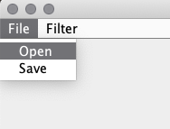
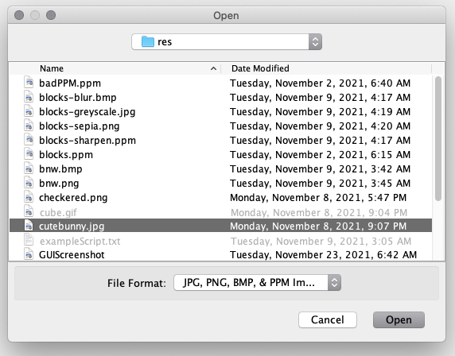
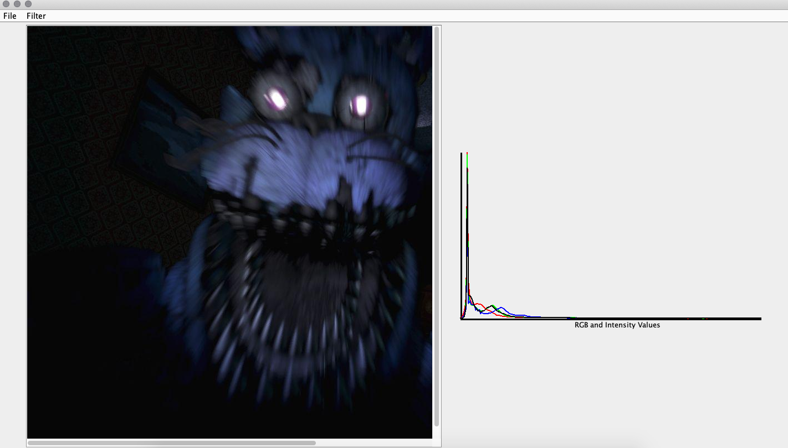
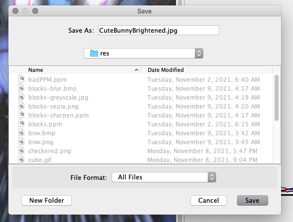
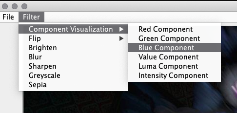
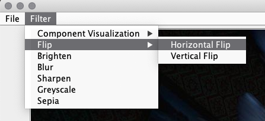
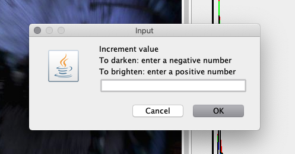
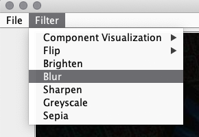
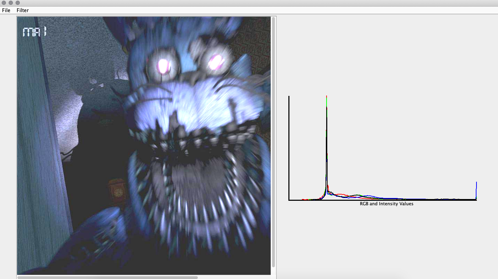

# Image Processor (Part 3)
Assignment 6 - Candice Mac and Anahi Burga

# How to use our GUI Image Processor:
When the program starts up, the GUI will provide a menu bar at the top of the window in which the user can interact with in order
to load in an image onto the Image Processor, save the image from the processor, or apply various filters onto the image.

### To load an image into the Image Processor:
  - The user will navigate the File tab on the menu bar and select Open.
  
  - A popup window should appear of their files, the user can then select an image with the compatible file type (jpg, png, bmp, 
    and ppm). 
  - Once the image is selected, the user should then click "Open" (on the bottom right corner of the window).
  
  - The image should now be loaded in, and a histogram will appear to the right of the image loaded in.
  
  - If a user wants to load in another image, they can simply repeat the steps above.

### To save an image from the Image Processor:
  - The user will navigate the File tab on the menu bar and select Save.
  - A popup window should appear of their files, and the user can type in the name of the new image with the file type extension
    in the "Save as" text box.
  - The user can now save the image onto the specified file path by clicking "Save" (on the bottom right corner of the window).
  

### To visualize a component:
  - The user will navigate to the Filter tab on the menu bar and select "Component Visualization".
  - This will prompt another list of options to pop up beside the list of filter options.
  
  - The user can now click on the preferred component to visualize, which include: Red, Green, Blue, Luma, Value, and Intensity component.
  - Once clicked, the image will refresh into a new image with the component visualized, and the histogram will change to reflect 
    the new filter. 

### To flip the image:
  - The user will navigate to the Filter tab on the menu bar and select "Flip".
  - This will prompt another list of options to pop up beside the list of filter options.
  - The user can now click on the preferred direction to flip the image by, which include vertical and horizontal.
  
  - Once clicked, the image will refresh into a new image that has been flipped.
  
### To brighten an image:
  - The user will navigate to the Filter tab on the menu bar and select "Brighten".
  - This will prompt a JOptionPane window to pop up, in which they are instructed to enter a number to brighten the image by.
  
  - If a user provides invalid input, they will get an error message pop up window.
  - If the input is valid, the image will refresh into a new image that has been brighten by the indicated amount, and the histogram
    will change to reflect the new image.

### To blur, sharpen, or apply a greyscale or sepia filter:
  - The user will navigate to the Filter tab on the menu bar and select either "Blur", "Sharpen", "Greyscale", or "Sepia".
  
  - Once clicked, the image will refresh into a new image with the filter applie, and the histogram will change to reflect the new image.
  

  